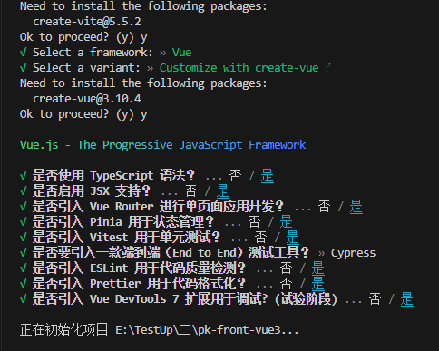
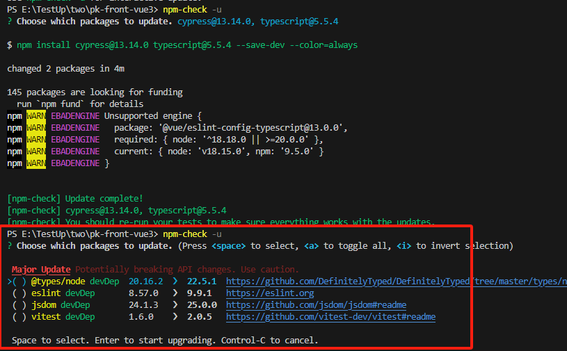
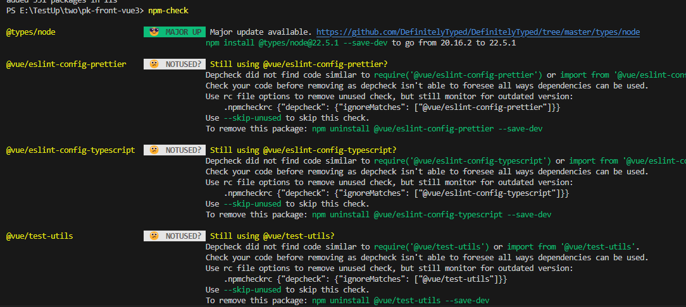

# 创建项目

npm init vite@latest pk-front-vue3



# 安装依赖 运行项目

```js
npm install

npm run format

npm run dev

// 全局安装pnpm
npm i -g pnpm

pnpm i -D sass

// 删除浏览器所有默认样式

pnpm i reset-css
```

# 包更新工具插件

```js
// 包更新工具1
npm i -g npm-check

npm-check

npm-check -u

// 工具2 未尝试
npm-check-updates

// git平台bot
```





# 基于文件系统自动生成路由

```js
// 1 支持vite
pnpm i -D vite-plugin-pages

// 2 支持 webpake vite esbuild Rollup
pnpm i -D unplugin-vue-router
```

# 页面布局

```js
//
vite - plugin - vue - layouts
```
