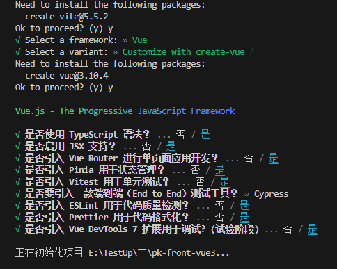
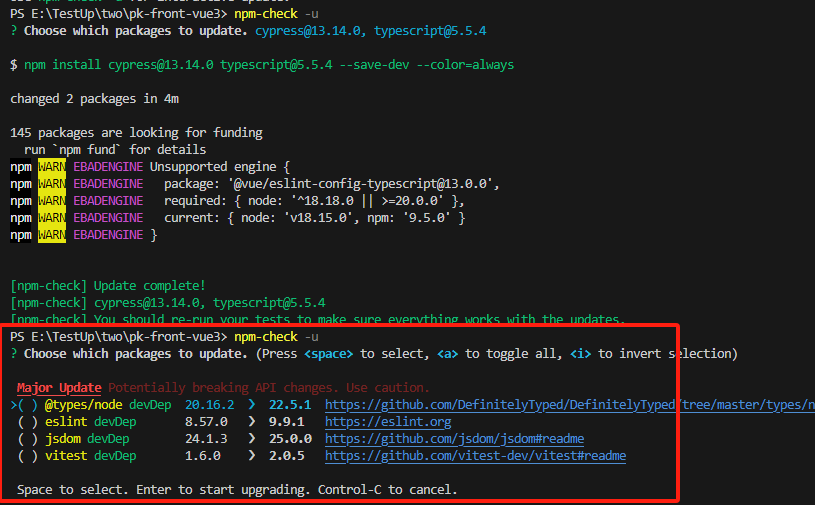
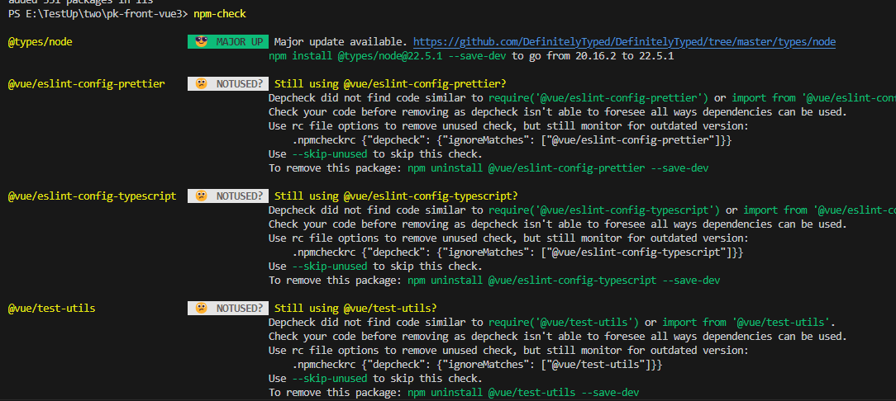
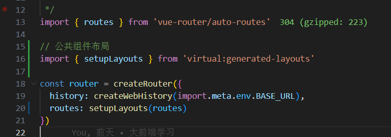

# 创建项目

npm init vite@latest pk-front-vue3



# 安装依赖 运行项目

```js
npm install

npm run format

npm run dev

// 全局安装pnpm
npm i -g pnpm

pnpm i -D sass

// 删除浏览器所有默认样式

pnpm i reset-css
```

# 更新依赖 包更新工具插件

```js
// 包更新工具1
npm i -g npm-check

npm-check

npm-check -u

// 工具2 未尝试
npm-check-updates

// git平台bot
```





# 基于文件系统自动生成路由

```js
// 1 支持vite
pnpm i -D vite-plugin-pages

// 2 支持 webpake vite esbuild Rollup
pnpm i -D unplugin-vue-router

// 3.重点 路由公共组件的布局
pnpm i vite-plugin-vue-layouts
// 图片官网配置有差异，ts识别限制extendRoutes，配合unplugin-vue-router使用，多出了公共组件的布局
```



# 自动引入

```js
// 自动引入方法
pnpm i -D unplugin-auto-import
// 自动引入组件
pnpm i -D unplugin-vue-components
// 自动引入样式 暂时无用使用unplugin-vue-components配置后引入的element-plus组件有样式
pnpm i -D vite-plugin-style-import
```

# 图标库选择

```js
/**
 * 支持自动引入识别配合插件unplugin-icons和unplugin-vue-components
 * 详情查看  vite.config.ts
 *
 * https://icones.netlify.app/
 * https://unocss.nodejs.cn/
 * https://iconify.design/
 * */

// 自动加载图标
pnpm i -D unplugin-icons
```

# PWA 渐进式 Web 应用

安装后可获得一个桌面应用图标，可离线访问该web

```js
// 插件支持
pnpm i vite-plugin-pwa -D
```

# Mock插件 模拟数据

```js
pnpm i -D vite-plugin-mock
```
